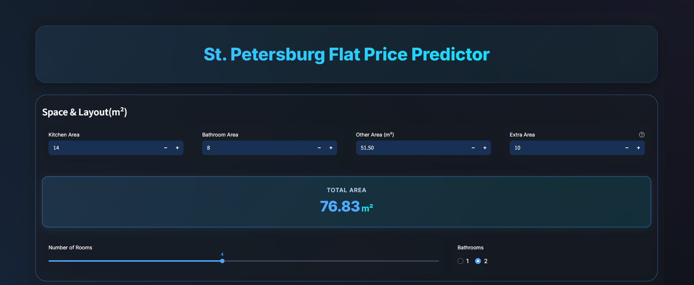
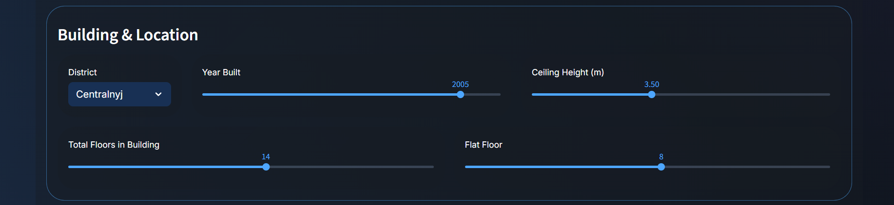
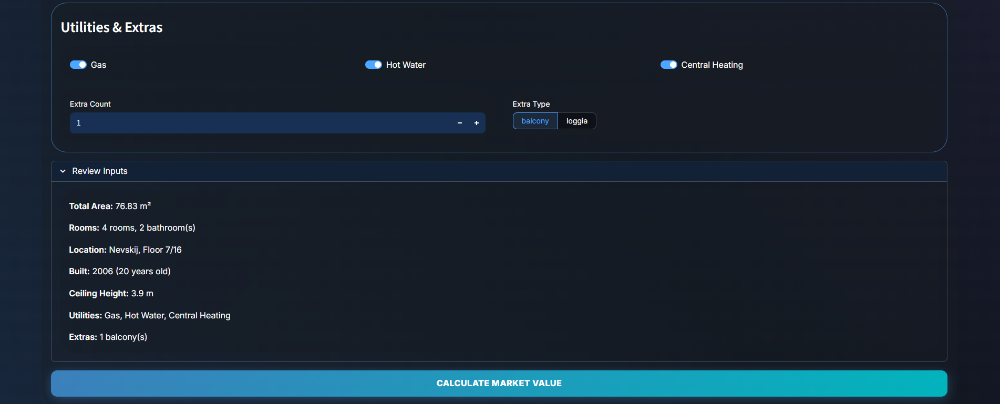
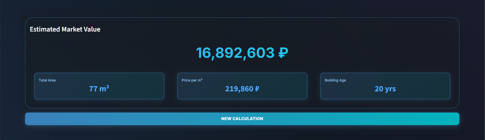

# St. Petersburg Flat Price Predictor

> A machine learning application for estimating residential property values in St. Petersburg, Russia. This project leverages a CatBoost regression model trained on synthetic data to provide accurate market value predictions for 2026.

---

## Overview

The application employs a comprehensive feature set including spatial characteristics, building specifications, location data, utilities, and amenities to deliver precise price estimates. The interactive interface is built with Streamlit, enabling users to receive real-time predictions based on property attributes.

---

## Key Features

-  **Interactive Input Interface**: Comprehensive controls for property specifications including floor area, room configuration, building characteristics, and amenities
-  **Real-Time Predictions**: Instant market value estimation in Russian Rubles (₽)
-  **Modern UI Design**: Professional dark-themed interface with enhanced visual elements
-  **Complete Model Pipeline**: Includes Jupyter notebook for data exploration, model training, and evaluation
-  **Deployment Ready**: Configured for local execution or cloud deployment

---

## Project Structure
```
st-petersburg-flat-price-predictor/
├──  jupyter_notebook/
│   ├──  data.csv                                    # Training dataset
│   ├──  test.csv                                    # Test dataset
│   └──  ITMO Flat Price Prediction 2025-2026.ipynb  # Model development notebook
├──  streamlit_app/
│   ├──  app.py                                      # Main application
│   ├──  styles.css                                  # Custom styling
│   ├──  flat_price_model_2026_full.pkl              # Trained model
│   └──  .streamlit/
│       └──  config.toml                             # Application configuration
└──  screenshots/                                    # Application screenshots
```

> **📌 Note**: The `.streamlit` directory follows the standard Streamlit convention for configuration files. On Unix-like systems, this appears as a hidden folder.

---

## Screenshots






---

## Prerequisites

-  Python 3.8 or higher
-  PyCharm 
-  Jupyter Notebook

---

## Technology Stack

### **Backend Logic**
- Python
- NumPy
- Pandas

### **Machine Learning**
- CatBoost
- Scikit-learn

### **Frontend**
- Streamlit
- CSS

### **Deployment**
- Pickle (Model Serialization)

---
